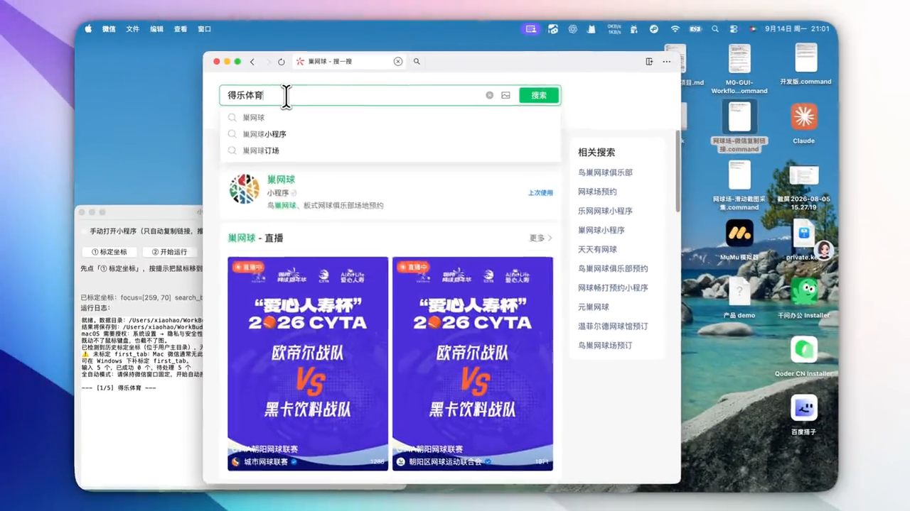

# 微信小程序链接批量采集器

> 把一批「小程序名称」丢进 Excel，工具自动在微信里逐个搜索 → 打开小程序 → 点 `···` → 复制链接 → 写回 Excel。
> 支持 **macOS / Windows**，纯 Python + 图形界面，不需要微信开放平台权限，不需要任何服务端。

<p align="center">
  <a href="https://github.com/m2290526022-boop/wechat-miniapp-link-copier/blob/main/assets/demo.mp4">
    
  </a>
  <br>
  <b>▶ 点击封面播放演示视频</b>（约 74 秒 / 6 MB，建议全屏观看）
  <br>
  <sub>播放不了的话直接下载：<a href="https://raw.githubusercontent.com/m2290526022-boop/wechat-miniapp-link-copier/main/assets/demo.mp4">raw demo.mp4</a></sub>
</p>

---

## 一、解决什么问题

做小程序内容聚合、场地库、门店库时，常见的一个体力活是：**给几十上百个主体补上它的小程序链接**。

微信没有提供批量查询入口，只能人工一个个来：

```
复制名称 → 微信搜索 → 打开小程序 → 点「···」→ 点「复制链接」→ 粘贴回 Excel → 回到下一行
```

单条 20~30 秒，50 条就是半小时起，而且极容易漏行、粘错行。本工具把这一整套动作自动化，人只需要**在开始前标定一次坐标**（1 分钟），之后按下运行键就行。

实测：54 条约 6~8 分钟跑完，全程无人干预；失败项会自动重试并标注状态，跑完只需人工看一遍 `状态` 列。

---

## 二、快速开始

### macOS

```bash
git clone https://github.com/m2290526022-boop/wechat-miniapp-link-copier.git
cd wechat-miniapp-link-copier
./setup_mac.sh        # 建虚拟环境 + 装依赖 + 自检
./run_mac.command     # 启动界面（或直接双击 run_mac.command）
```

然后**授权一次**（不授权的话鼠标键盘动不了）：

> 系统设置 → 隐私与安全性 → **辅助功能** → 勾选「终端 / Terminal」
> 系统设置 → 隐私与安全性 → **屏幕录制** → 勾选「终端 / Terminal」

### Windows

```bat
git clone https://github.com/m2290526022-boop/wechat-miniapp-link-copier.git
cd wechat-miniapp-link-copier
setup_windows.bat     :: 建虚拟环境 + 装依赖 + 自检
run_windows.bat       :: 启动界面
```

Windows 不需要额外授权，但请**把微信窗口固定在屏幕上的一个位置**，运行期间不要移动、最小化、改缩放比例。

> ⚠️ **macOS 装 Python 的坑**：一定要用 [python.org](https://www.python.org/downloads/macos/) 的 `.pkg` 安装版。
> macOS / Xcode 自带的 `/usr/bin/python3` 是「非 framework」构建，`tkinter` 能 import 但窗口**一片白屏**——
> 界面什么都没有，很容易误以为是脚本坏了。`setup_mac.sh` 会主动检测并拦下这种情况。

---

## 三、使用流程

界面上一共 5 个按钮 + 1 个模式开关：

| 按钮 | 作用 |
| --- | --- |
| **① 标定坐标** | 按提示逐点倒计时自动捕获鼠标位置（不用碰键盘，不会丢焦点）。标定结果存到 `~/wechat_scraper_points.json`，以后不用重复标 |
| **② 开始运行** | 从 `data/输入.xlsx` 读名称逐条采集，结果实时写 `data/结果.xlsx`，日志滚动输出 |
| **③ 清空结果重跑** | 保留表头、清掉数据行后重跑（不会删文件） |
| **检查剪贴板** | 看当前剪贴板内容，验证「复制链接」拿到的格式是否为 `#小程序://…` |
| **打开输入表 / 打开数据目录** | 一键打开 `data/` 下的输入表或目录，方便填表与取结果 |

### 两种模式

- **手动模式（默认，推荐）** — 勾选「手动打开小程序（只自动复制链接）」。
  你自己手动把小程序打开，工具只负责后面「点 `···` → 点复制链接 → 读剪贴板 → 写 Excel」，一次只在弹窗里点「已打开，继续」。
  只依赖 3 个坐标点，稳，不怕微信搜索改版。
- **全自动模式** — 取消勾选。工具会自己聚焦微信、搜索名称、点第一个搜索结果、打开小程序，全流程无人值守。
  需要多标 3~4 个点（含 Windows 专有的结果 tab 复位点），对微信搜索 UI 改版更敏感。

### 标定点说明

| 点位 | 位置 | 何时需要 |
| --- | --- | --- |
| `dots` | 小程序面板右上角「`···`」按钮 | 两种模式都需要 |
| `copy_link` | 展开菜单里的「复制链接」菜单项 | 两种模式都需要 |
| `close_app` | 小程序右上角「✕」（在 `···` 左边） | 两种模式都需要，复制完关掉当前小程序，避免窗口越开越多 |
| `focus` | 微信主窗口标题栏空白处 | 仅全自动模式（用于聚焦窗口） |
| `search_box` | 微信顶部搜索输入框 | 仅全自动模式 |
| `search_result` | 搜索后出现的第一个搜索结果 | 仅全自动模式 |
| `first_tab` | 搜索结果最左侧第一个 tab | 仅 **Windows 全自动**模式（每次搜索前复位，避开上一条留下的公众号/文章 tab）；macOS 会自动跳过 |

坐标只和**窗口位置 + 分辨率/缩放**绑定，所以标定完请不要移动微信窗口。

---

## 四、输入 / 输出

```
data/
├── 输入.xlsx    # A 列「小程序名称」，一行一个，填完即跑
└── 结果.xlsx    # 采集结果
```

`结果.xlsx` 五列：

| 名称 | 复制链接 | AppID | Path | 状态 |
| --- | --- | --- | --- | --- |
| 得乐体育 | `#小程序://得乐体育/…` | （该链接格式无 appid 参数，通常为空） | （链接内 `url=` 参数） | `OK` / `FAIL` / 异常原因 |

所有链接都会过一遍格式校验（`#小程序://` 前缀 + 长度），校验不过的会**自动重试最多 3 次**（每次多加 1.5 秒等待，应对小程序加载慢）。重跑时同一名称的旧行会被覆盖而不是追加，所以可以放心反复跑。

> 仓库里的 `data/` 是**真实采集样例**：54 条北京网球场名称 + 对应采集结果，可以直接拿来对照运行效果。

---

## 五、为什么是「坐标点击」——一个必须说清的取舍

自动化微信小程序，最优雅的方案应该是读控件树（Windows 用 UI Automation，macOS 用 Accessibility API）。**但这条路走不通**：

- **Windows 微信是 Qt 自绘的**，控件树里读不到「复制链接」这种菜单项，只有一大块 canvas；
- **macOS 微信虽是原生 App，但小程序面板是 webview**，同样读不到内部控件。

所以「按屏幕坐标点」是双端唯一通用的可行解。代价也很清楚：微信改版、换分辨率、多屏、改缩放都会让坐标失效。

针对这个代价，代码里做了三层处理：

1. **定位被隔离成一层**（`locator.py`）。主流程只调用 `locator.point("dots")` 这样的语义接口，完全不知道坐标从哪来。
   今天用的是 `CoordinateLocator`（读标定 JSON），将来换成模板匹配 / 视觉大模型定位时，**主流程一行都不用改**，只替换 `create_locator()` 工厂的返回值即可。这就是「预留 Vision 接口」的实际含义。
2. **坐标存到用户主目录** `~/wechat_scraper_points.json`，改脚本、挪目录都不会丢标定。
3. **平台差异全部收在一层**（`platform_adapt.py`）。修饰键（`Cmd` vs `Ctrl`）、打开文件（`open` vs `startfile`）、权限提示，主流程里不出现任何 `if macOS`。

### 另一个关键实现细节：中文必须走剪贴板

`pyautogui.typewrite()` **只能发 ASCII**，打不出「得乐体育」这种中文名，会直接丢字符。
所以输入名称统一走 `pyperclip.copy()` + `Cmd/Ctrl+V` 粘贴。这不是偷懒，是这个方案能成立的前提——代码里也写了注释提醒不要改回去。

---

## 六、目录结构

```
wechat-miniapp-link-copier/
├── wechat_scraper_gui.py     # 主程序：图形界面 + 采集主流程
├── platform_adapt.py         # 跨平台适配层（修饰键 / 打开文件 / 权限提示）
├── locator.py                # 定位抽象层（坐标实现 + 预留模板匹配接口）
├── requirements.txt
├── setup_mac.sh              # macOS 一键安装（含 tkinter / 非 framework Python 检测）
├── run_mac.command           # macOS 启动器（双击）
├── setup_windows.bat         # Windows 一键安装
├── run_windows.bat           # Windows 启动器（双击）
├── assets/                   # 演示视频与封面
└── data/                     # 输入表 / 结果表（含真实采集样例）
```

---

## 七、已知限制

- **坐标绑定窗口位置**：移动微信窗口 / 改分辨率 / 改缩放 / 换显示器后需重新标定（工具会把标定文件写到主目录，重标覆盖即可）。
- **UI 改版敏感**：全自动模式依赖微信搜索结果的排版，微信大版本更新后可能需要重新标定或调等待时间；手动模式不受影响。
- **运行期间不能碰鼠标键盘**：这是所有坐标点击类工具的通病，跑的时候让机器空着。
- **未适配 Linux**：`platform_adapt.py` 里已留了 `xdg-open` 分支，但没有实测。
- **不做 OCR / 图像识别**：当前刻意只用坐标，把「更稳的定位方式」留给 `locator.py` 的接口去演进。

---

## 八、常见问题

| 现象 | 原因 / 处理 |
| --- | --- |
| 双击后窗口一片白 | 用了 Xcode 自带的 `/usr/bin/python3`（非 framework 构建）。装 python.org 版 Python 后重跑 `setup_mac.sh` |
| 点了没反应、鼠标不动 | macOS 未授权「辅助功能」。授权后**重启终端**再运行 |
| 全部项都是 `FAIL` | 坐标没标定或已失效（换了窗口位置）。重跑「① 标定坐标」 |
| 搜索结果点到公众号/文章而不是小程序 | 全自动模式：确认已标定 `first_tab`（Windows）；或先进小程序面板再跑 |
| 单条偶尔失败 | 小程序加载慢。把界面上的「打开后等待(秒)」调到 8~10 再跑该条 |
| `结果.xlsx` 打不开/写不进 | 采集时请在 Excel 里关闭该文件（程序最多会等 15 秒重试） |

---

## License

MIT
